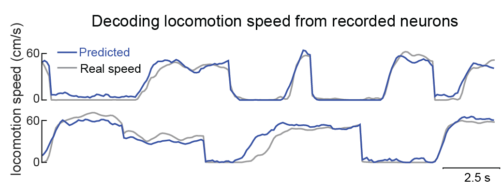
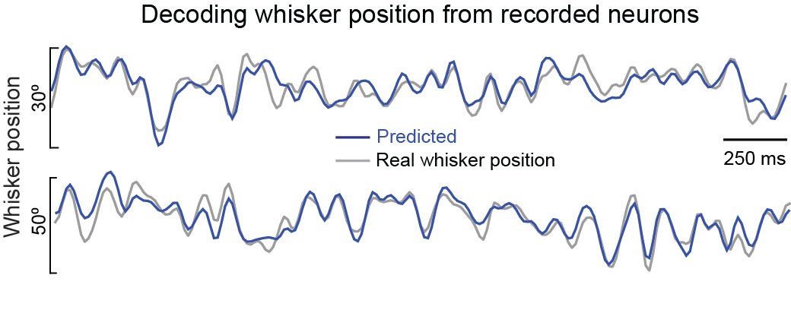

# Neural decoding model
### A Python and MATLAB package for decoding neural activity and predicting body position
A regression model that can decode whisker position and locomotion speed from neuronal spike times.
There are both Python and MATLAB versions of this code. 

## Getting started
The folder raw_data contains some sample data to get started. I would suggest running this repository in python, as the codes written in python are mode advanced version and regularly updated.
### Running in Python
Two files are required to run the decoder in Python
 - **`runfile.ipynb`** is a notebook that allows you to run through the whole process of decoding from start to finish.
 - **`pick_n_bins.ipynb`** is a notebook that allows you to decide how many surrounding bins around the current time t to choose for decoding.
 - **`functions.py`** contains all the backend functions that are used in the notebook. To adjust parameters for the machine learning model, you might have to tweak through these. 
### Running in MATLAB
 - **`runfile.m`** allows you to run through the whole process of decoding from start to finish.
 - Rest of the .m files are the functions used in the main file.
  
  

  
  

